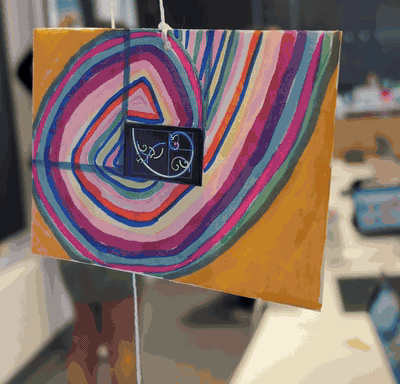
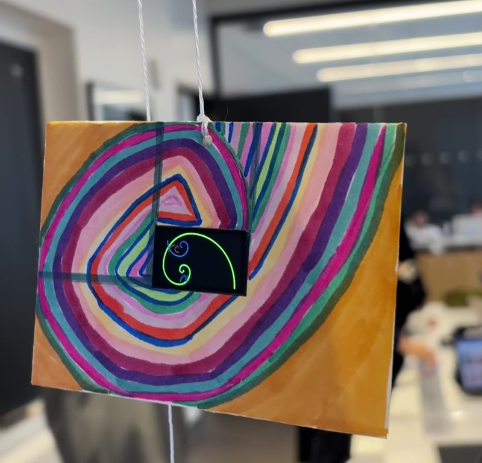

# Fibonacci Spiral Fractal for the TTGO T-Display

Generative art for the LilyGO TTGO T-Display ESP32. The code behind this art follows the fibonacci sequence, where each cycle sketches a rectangle, into squares, and then draws the golden spiral through them. The code adjusts the color palette, line weight, orientation, animation speed, and recursive depth of the art, to keep it from repeating. However, despite each frame being different, all the frames stay faithful to the classic fibonacci pattern, where the spiral randomly grows and creates smaller spirals, becoming self similar fractal art. 



*The T-Display running the sketch, mounted in a hand-painted spiral card.*

Blog post with more background: _link coming soon_

## Design goals

- **Growing spiral that doesn't loop.** The spiral is drawn square by square so you watch it form. 
- **Mathematical authenticity.** Every square stays true to the mathematics behind the golden ratio, where each quarter arc is centered on the corner, keeping the curve tangent continuous.
- **Never the same twice.** Colour palette, mirror orientation, line width, fractal depth (1–3 levels), spawn probability and drawing speed are all drawn from `random()` each cycle. This satisfies the "more than a GIF" requirement for Module 1.
  
## How it works

1. `newCycle()` rolls the random parameters and clears the screen.
2. `spiral()` takes a rectangle and repeatedly splits off the largest square (left, top, right, bottom, in rotation), drawing one quarter arc per square. The remaining rectangle is itself golden, so the loop continues until squares are smaller than 4 px.
3. While drawing, each square has a `spawnChance` % chance of recursively calling `spiral()` on a smaller golden rectangle inside itself, with a hue shift of 120°. That recursion is what makes it fractal.
4. `loop()` holds the finished image, redraws it three times with a shifting hue for a shimmer effect, then starts a new cycle.

## Hardware

| Part | Notes |
|---|---|
| LilyGO TTGO T-Display | ESP32, ST7789 135×240 TFT, USB-C |
| USB-C cable | Battery Attachment|



To recreate the mount: cut a 24 × 14 mm window in card stock, paint the spiral out from the window, and tape the board behind it with corresponding battery for the display used. 

## Replicate it

1. **Install the Arduino IDE** (2.x): https://www.arduino.cc/en/software
2. **Install the ESP32 boards.** In *Settings → Additional boards manager URLs* add
   `https://espressif.github.io/arduino-esp32/package_esp32_index.json`, then in *Boards Manager* install **esp32 by Espressif**. Version 2.0.17 is what this was built with; 3.x also works.
3. **Install TFT_eSPI.** *Tools → Manage Libraries*, search `TFT_eSPI` by Bodmer, install.
4. **Point TFT_eSPI at the T-Display.** Open `Documents/Arduino/libraries/TFT_eSPI/User_Setup_Select.h`:
   - comment out `#include <User_Setup.h>`
   - uncomment `#include <User_Setups/Setup25_TTGO_T_Display.h>`
5. **USB driver.** Boards with a CH9102 chip need the WCH CH34x driver (see the [LilyGO repo](https://github.com/Xinyuan-LilyGO/TTGO-T-Display)). Boards with a CP210x chip show up as `usbserial` with no extra driver on recent macOS.
6. **Open the sketch** `FibonacciSpiral/FibonacciSpiral.ino` and set:
   - *Tools → Board → esp32 → ESP32 Dev Module*
   - *Tools → Port* → your board's port
   - *Tools → Upload Speed → 115200*
   - *Tools → PSRAM → Disabled*, *Flash Size → 4MB*
7. **Upload.** The spiral starts as soon as the board resets, and runs from flash on any USB power source afterwards.

If you use `arduino-cli`, the included `sketch.yaml` already carries the board settings; edit `default_port` for your machine.

## Make it your own

All the knobs live in `newCycle()`:

| Variable | Effect |
|---|---|
| `baseHue`, `hueStep` | starting colour and how fast colour shifts per square |
| `maxDepth` | how many levels of nested spirals (1 = plain spiral) |
| `spawnChance` | % chance a square grows a child spiral |
| `lineW` | arc thickness in pixels |
| `showSquares` | outline the tiling squares |
| `stepDelay` | ms between squares, i.e. drawing speed |

Narrow or widen the `random()` ranges to bias the look, or fix a value to pin it.

## Repository layout

```
FibonacciSpiral/      Arduino sketch (folder name must match the .ino)
  FibonacciSpiral.ino
  sketch.yaml         board profile for arduino-cli
docs/images/          demo GIF and installation photos
```

## Credits

Built for COMS 3930 (Fall 2026) at Columbia. Uses [TFT_eSPI](https://github.com/Bodmer/TFT_eSPI) 
Claude Fable 5.1 
